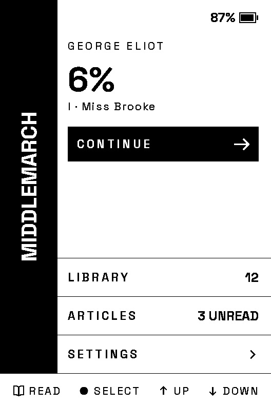
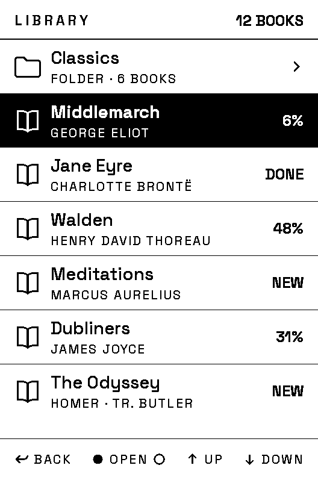
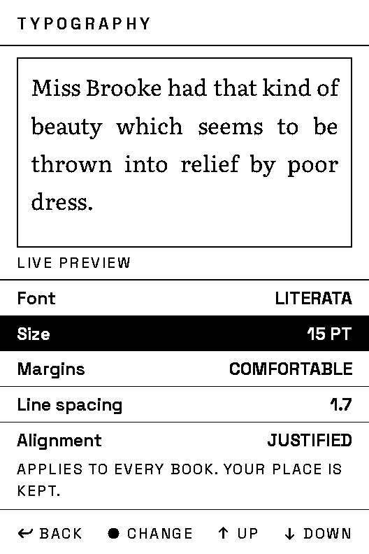

# Encre

Open-source firmware for the Xteink X4 and X3 e-readers. One binary drives both
models; it works out which one it is at boot.

<p align="center">
  
</p>

## What it does

- [x] Reads EPUB, with justified text and italics taken from the book's own stylesheet
- [x] A library you can browse by folder, with per-book progress on every row
- [x] The book's own table of contents
- [x] Peek at a chapter over the page you're on, before deciding to jump
- [x] One button back to the furthest page you reached
- [x] Five type sizes, three margins, seven line spacings, justified or ragged, all with a live preview
- [x] Your book's cover on the sleep screen, in four shades of grey
- [x] Reading position kept on the SD card, and not lost if you delete the book
- [x] Book details, and marking a book finished
- [x] Battery level, a warning when it runs low, and a clean shutdown before it dies
- [x] Joining a Wi-Fi network, and pulling your Wallabag reading list over it
- [ ] Sending books over Wi-Fi
- [ ] Bookmarks
- [ ] Plain text files
- [ ] Hyphenation, and better line breaking
- [ ] A boot screen

<table>
<tr>
<td width="25%"></td>
<td width="25%"></td>
<td width="25%"></td>
<td width="25%"></td>
</tr>
<tr>
<td><em>Picks up where you left off.</em></td>
<td><em>Folders, and how far into each book you are.</em></td>
<td><em>Size, margins, spacing and alignment, previewed live.</em></td>
<td><em>The cover while it sleeps, with your place on it.</em></td>
</tr>
</table>

## Before you flash

**Take a backup of the stock firmware.** It is step 3 below, it takes a couple
of minutes, and it is worth doing. The device is recoverable either way, since
there is no secure boot and no flash encryption, so download mode is always
available. But a backup is the difference between a bad afternoon and a dead
reader.

Flashing third-party firmware is at your own risk. This was written with
[Claude Code](https://claude.com/claude-code), directed and reviewed by its
owner, and the checks behind it are real: unit tests, pixel-exact reference
renders at both panel sizes, and a comparison of every screen against its design
drawing. They are also not everything. The layer that talks to the hardware has
no automated tests, and this project has more than once shipped something that
passed every desktop check and was wrong on the actual panel. It has been used
daily on an X3, but expect to find things.

## Install

Four steps. Replace `PORT` with yours throughout, and `VERSION` with the release
you downloaded.

**1. Install [esptool](https://docs.espressif.com/projects/esptool/).**

```bash
pip install esptool
```

**2. Plug the reader in and find its port.**

| | Port looks like | How to find it |
|---|---|---|
| macOS | `/dev/cu.usbmodem1101` | `ls /dev/cu.usbmodem*` |
| Linux | `/dev/ttyACM0` | `ls /dev/ttyACM*` |
| Windows | `COM5` | Device Manager, under Ports (COM & LPT) |

**3. Back up the stock firmware.** Check the file really is 16 MB before you
trust it.

```bash
esptool --port PORT read-flash 0 0x1000000 xteink-stock-backup.bin
```

**4. Download the latest `encre-VERSION-xteink-full.bin` from
[Releases](https://github.com/Rukkaitto/encre/releases), and write it.**

```bash
esptool --port PORT --chip esp32c3 write-flash 0x0 encre-VERSION-xteink-full.bin
```

If anything goes wrong, `write-flash 0 xteink-stock-backup.bin` puts the
original back.

> esptool 5 spells these `read-flash` and `write-flash`; version 4 and earlier
> use `read_flash` and `write_flash`. `pip install esptool` gives you 5.

**A screen that never changes does not mean the firmware failed to start.**
E-ink holds its last image with no power at all, and nothing wipes the screen at
boot, so the stock firmware's last screen can sit there looking frozen while
Encre is running perfectly well behind it. Press a button before concluding
anything.

## Updating

Once Encre is installed, take the smaller `encre-VERSION-xteink.bin` and write it
to the app partition instead:

```bash
esptool --port PORT --chip esp32c3 write-flash 0x10000 encre-VERSION-xteink.bin
```

The full image is only needed the first time, because it also lays out the
partitions.

## Putting books on it

The SD card can be FAT or exFAT. Books go in a `/books` folder as EPUB files,
loose or in subfolders. Both are listed, and subfolders can go as deep as you
like. The folder is created for you on the first boot that doesn't find one.

Encre keeps a few things of its own in `/.reader`: your settings, one small file
per book holding your place in it, and the cover it last prepared for the sleep
screen. Deleting a book from the library never touches your progress in it, so
putting the book back puts you back where you were.

Settings live in `/.reader/settings.json`, which is created with sensible
defaults and can be edited by hand. If you break it, Encre falls back to the
defaults and leaves your file exactly as you typed it.

## Articles from Wallabag

Encre can pull your [Wallabag](https://wallabag.org) reading list onto the
device over Wi-Fi. An article reads like any other book, and starring or
archiving one on the device tells your server the next time it syncs.

You need a Wallabag to point it at. If you don't host one,
[wallabag.it](https://wallabag.it) is about €11 a year and has a 14-day trial
that doesn't ask for a card.

Then, once per device:

1. Sign in to your Wallabag and open `/developer/client/create`.
2. Name the client. `Encre` will do. The name is how you revoke this reader
   later without revoking your phone with it.
3. Leave the redirect URI blank. Wallabag doesn't require one, and Encre never
   opens a browser.
4. It gives you a client ID and a client secret. Both are still at `/developer`
   if you lose them.

Now put the SD card in your computer and open `/.reader/wallabag.json`. Encre
writes that file on the first boot that doesn't find one, so it is already
there, with a few lines of help in it you can keep or delete:

```json
{
  "server": "https://app.wallabag.it",
  "clientId": "1_abc123",
  "clientSecret": "xyz789",
  "username": "you",
  "password": "your Wallabag password"
}
```

Put the card back, then open Settings, Wallabag, Sync now.

Syncing restarts the device. One encrypted connection leaves the memory too
fragmented to open a book afterwards, and only a restart gives it back, so
Encre takes it while the sync screen is still on the glass.

Your password sits in that file as you typed it, so anyone holding the card can
read it. Encre has no keyboard to ask you for it again, and Wallabag's token
lasts about a fortnight, so the password has to stay on the card.

## About the X4

Encre is developed and tested on the X3. One binary drives both models and the
X4 is supported, but nobody has run it on an X4. If the screen comes out upside
down, that is why, and it is worth an issue.

## If something goes wrong

Please [open an issue](https://github.com/Rukkaitto/encre/issues). Say which
model you have and what you were doing.

The most useful thing you can attach is a log. Encre can write one to the card
itself, which catches problems that only happen while it is unplugged:

1. Put the SD card in your computer and open `/.reader/settings.json`.
2. Set `"logToCard": true`.
3. Put the card back, and make the problem happen again.
4. Put the card in your computer and attach `/encre.log`.

## What's new

Every release has notes: see [Releases](https://github.com/Rukkaitto/encre/releases).
The unticked boxes above are what's planned, roughly in the order they matter.

## Contributing

Pull requests are welcome. See [CONTRIBUTING.md](CONTRIBUTING.md) for how to
build it, run the tests, and the few rules that are easy to trip over.

## Licence

Encre is MIT licensed. See [LICENSE](LICENSE).

It builds on work under other licences:
[freeink-sdk](https://github.com/Free-Ink/freeink-sdk) (MIT) for the display,
input, SD and battery drivers; Literata and Space Grotesk under the SIL Open
Font License 1.1 (`assets/fonts/`); and `stb_truetype`, `stb_image`,
`stb_image_write` (MIT / public domain) and TJpgDec (ChaN) in `third_party/`.
